# Irish Slang

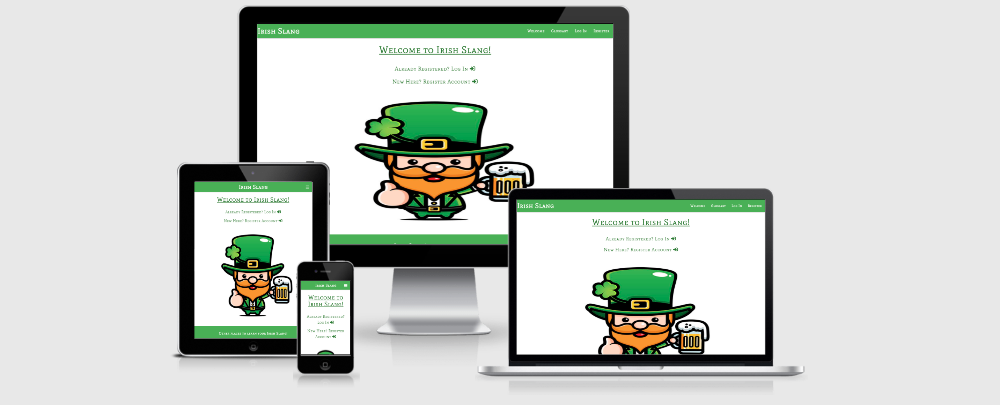

# Table of contents
- [User Experience](#user-experience)
  * [The project Goal](#the-project-goal)
- [User Stories](#user-stories)
- [User Requirements and Expectations](#user-requirements-and-expectations)
  * [Requirements](#requirements)
  * [Expectations](#expectations)
- [Design Choices](#design-choices)
  * [Typography](#typography)
  * [Icons](#icons)
  * [Colours](#colours)
  * [Imagery](#imagery)
  * [Wireframes](#wireframes)
  * [Data schema](#data-schema)
- [Features](#features)
- [Features left to implement](#features-left-to-implement)
- [Technologies](#technologies)
- [Testing](#testing)
  * [Lighthouse Testing](#lighthouse-testing)
  * [Bugs](#bugs)
  * [Functionality Testing](#functionality-testing)
  * [Responsiveness Testing](#responsiveness-testing)
  * [Usability Testing](#usability-testing)
  * [Testing Validators](#testing-validators)
  * [Compatability Testing](#compatability-testing)
  * [Testing User Stories](#testing-user-stories)
- [Deployment](#deployment)
  * [Deploy website to Github pages](#deploy-website-to-github-pages)
  * [Run Project With Gitpod](#run-project-with-gitpod)
  * [How to Run This In A Local IDE](#how-to-run-this-in-a-local-ide)
  * [Forking](#forking)
- [Credits](#credits)
  * [Code](#code)
  * [Content](#content)
  * [Hero images](#hero-images)
  * [About page images](#about-page-images)
  * [Our Tips page images](#our-tips-page-images)
  * [Resources](#resources)

- [Acknowledgements](#acknowledgements)

# User Experience

## The project Goal  
* The goal of this project is to creare a fictional glossary/dictionary website for words that are spoken on a daily basis among Irish people. It is aimed at people who may wish to
visit Ireland in the future and have an interest or an intrigue in words/phrases Irish people use. I want to create a website that is fun to use for the user
and that their personal details are secure.

# User Stories

## First time user stories

* I want to be able to navigate with no issues throughout the site.
* I want to be able to search for words commonly used in Ireland.
* I want to be able to create my account and to add my own words to the site.

## Registered user stories

* I want to be able to safely and easily log in, log out of the site.
* I want to be able to edit, delete the words that I added to the site.
* I want to be able to delete the profile that I created.
* I want to be able to see words added by other users of the site.

## Site owner user stories

* To give site accessibility even if user has not created an account.
* To allow users to soley edit, delete their own words that they have added.
* To be able to delete any material added by a registered user which falls under misconduct of site regulations.

# User Requirements and Expectations

## Requirements

* To navigate around the site in an easy fashion with no broken internal links
* All features such as login, register, contact form, collapsible and card-panels to be operating efficentley
* All text content to eligible, readbale and viewable across different devices such as desktop, tablet and mobile.
* for website to have a high level of safety and security when user is logged in, the copied url once pasted when the
  url has logged out will be redirected back to the log in page.

## Expectations

* Navigation of the website is working appropriatley and efficentley with no broken internal links.
* All features above in requirements section is working appropriatley.
* Text content is easy to read,view across all devices
* Website is highly secured with user's profile secured against intrusion from other users, vistors to the site.

# Design Choices

* Considering this is an Irish slang dictionary I wanted the color scheme to adopt the tricolor flag colors of Ireland which is green, white and orange.
  The feeling was that it was the most appropriate design choice of colors as users will instantly feel the connection between the Irish tricolors and the slang glossary.
  An image of a leprachaun is present on the homepage to offer imagery but to also offer a well reknowned representation of Irish fiction.
  Features such as login, register search bar and collapsible glossary are styled similarly for consistency in design. Collapsible, footer,buttons and navbar and sidenav are taken from
  [CSS Materialize](https://materializecss.com/) for instant responsiveness and positive looking user interface.

## typography

* [Google Fonts](https://fonts.google.com/) was used for the site. The font family adopted  was  Mate SC as I felt it was an attractive, readable and eligible font to use. In case Mate SC did not
  load sans serif was used as the back up font.

## Icons
* [Font Awesome](https://fontawesome.com/) icons were used as a decorative purpose used to style the site including the social media links in the footer.

## Colours

* [Coloors](https://coolors.co/) was used to portray, visually my color scheme adoption. The colors used resembled the Irish flag to get an Irish feel as the site is a 
Irish slang dictionary. To view color scheme click [here](https://github.com/markgordon22/irish-slang/blob/master/wireframes/colorscheme.png).

## Imagery

* The sole image used for the site was a hero image on the home page of a leprachaun with a pint of beer. Once the user accesses home page and begins
their journey through the site they will see the image. Image of the leprachaun was used as it fits one of the stereotypes that leprachauns exist.
Image of the leprachaun evokes the feeling of Ireland instantly to the user that can not be carried out with plain text. 
Click [here](https://github.com/markgordon22/irish-slang/blob/master/static/img/leprachaunimage.jpg) to see the image.

## Wireframes

* See wireframes [here](https://github.com/markgordon22/irish-slang/blob/master/wireframes/wireframes-irish-slang.pdf)

## Data schema

For the data schema there were three collections used to carry out the site's operations. They are listed below

1. Categories
2. users
3. Words

The categories collection have the following fields.

-> _id: objectID(string) ,category_name: "string"

The users collection have the following fields.

-> _id: objectID(string), username: "string", password: "string".

The words collection have the following fields.

-> _id: objectID(string), category_name: "string", word_name: "string, word_def: "string", definition_example, created_by: "string".

Text version of the schema can be viewed [here](/workspace/Dublin-slang/wireframes/data.txt)

# Features

* Features implemented for the website include the following.

* Simple and easy navigation around the site.
* Consistent and easy to follow design.
* Login, register forms for user to log into their account or register account
* Glossary of Irish words for user to browse through slang words of Ireland
* Search bar for user to search a word.
* CSS materialize buttons and cards, navbar,footer and sidenav.
* Responsive on phone, tablet and desktop devices.

# Features left to implement

* None

# Technologies

 Technologies used

 Languages

* [HTML](https://en.wikipedia.org/wiki/HTML)
* [CSS](https://en.wikipedia.org/wiki/CSS)
* [Javascript](https://en.wikipedia.org/wiki/JavaScript)
* [Python](https://en.wikipedia.org/wiki/Python_(programming_language))
* Python modules and dependencies based in requirements.txt file.
  * click==8.0.1
  * dnspython==2.1.0
  * Flask==2.0.1
  * Flask-PyMongo==2.3.0
  * itsdangerous==2.0.1
  * Jinja2==3.0.1
  * MarkupSafe==2.0.1
  * pymongo==3.11.4
  * Werkzeug==2.0.1
   

Libraries and Frameworks

* [Am I Responsive](http://ami.responsivedesign.is/) Used to create a mockup of website.
* [Pip3](https://pypi.org/project/pip/) to install Python modules from the command line.
* [BSon](http://bsonspec.org/)
    - This was imported in order to access the data used across the site.
* [HTML validator](https://validator.w3.org/)
    - testing validator for html code
* [Javascript validator](https://jshint.com/)
    - testing validator for javascript code
* [CSS validator](https://validator.w3.org/) 
    - testing validator for css code
* [pep8 validator](http://pep8online.com/checkresult)
    - testing validator for python code
* [Flask](https://flask.palletsprojects.com/en/1.1.x/)
    - Flask was used to import the following below
    * flash
    * render_template
    * redirect
    * request
    * session
    * url_for functions.
* [JQuery](https://jquery.com/)
    - JQuery in scripts.js file in static folder was used to activate materialize components. To add, I also used Code Institute's JQuery code from the Task Manager project so that the category names could be selected and cited.
* [Balsamiq](https://balsamiq.com/) 
    - to do wireframes for respective devices
* [Font Awesome](https://fontawesome.com/)
    - Font awesome used in site to implement icons for atractive visual purposes, boosting user experience. 
* [Git](https://git-scm.com/)
    - for version control with the use of the gitpod terminal to commit to Git and push code to GitHub.
* [GitHub](https://github.com/)
    - used for storage of code after it has been pushed Gitpod terminal.
* [Google Fonts](https://fonts.google.com/)
    - Google fonts were used to import selected font
* [CSS formatter](https://www.cleancss.com/css-beautify/)
    - To beautify css code
* [Javascript formatter](https://beautifier.io/)
    - To beautify javascript code.
* [Heroku](https://dashboard.heroku.com/apps)
    - Heroku is used for deployment of the site.
* [Autoprefixer](https://autoprefixer.github.io/) 
    - to add vendor prefixes to css
* [Materialize 1.0.0](https://materializecss.com/)
    - used for responsiveness and styling purposes. Materialize was used for cards,navbar,footer, sidenav and buttons.   
* [MongoDB](https://www.mongodb.com/1)
    - MongoDB - used to host data on site.
* [HTML freeformatter](https://www.freeformatter.com/html-formatter.html)
    - to beautify html code  
* [Werkzeug](https://werkzeug.palletsprojects.com/en/1.0.x/)
    - Password security to authenticate site.
* [Markdown](https://docs.github.com/en/github/writing-on-github/basic-writing-and-formatting-syntax) 
    - Assisted with links site elements such as images,content,wireframes and code sources used.
* [GitHub Wiki TOC generator](https://ecotrust-canada.github.io/markdown-toc/) 
    - to generate own MarkDown TOC online.
*  Chrome dev tools to detect bugs in the code.

# Testing

## Lighthouse testing

### Lighthouse test results are below

* Desktop test results

* [Add category](https://github.com/markgordon22/irish-slang/blob/master/testing/lighthouse/desktop-addcategory.pdf)
* [Add word](https://github.com/markgordon22/irish-slang/blob/master/testing/lighthouse/desktop-addword.pdf)
* [Categories](https://github.com/markgordon22/irish-slang/blob/master/testing/lighthouse/desktop-categories.pdf)
* [Edit category](https://github.com/markgordon22/irish-slang/blob/master/testing/lighthouse/desktop-editcategory.pdf)
* [Edit word](https://github.com/markgordon22/irish-slang/blob/master/testing/lighthouse/desktop-editword.pdf)
* [Glossary](https://github.com/markgordon22/irish-slang/blob/master/testing/lighthouse/desktop-glossary.pdf)
* [Log in](https://github.com/markgordon22/irish-slang/blob/master/testing/lighthouse/desktop-login.pdf)
* [Profile](https://github.com/markgordon22/irish-slang/blob/master/testing/lighthouse/desktop-profile.pdf)
* [Register](https://github.com/markgordon22/irish-slang/blob/master/testing/lighthouse/desktop-register.pdf)
* [Welcome](https://github.com/markgordon22/irish-slang/blob/master/testing/lighthouse/desktop-welcome.pdf)

* Mobile test results

* [Add category](https://github.com/markgordon22/irish-slang/blob/master/testing/lighthouse/mobile-addcategory.pdf)
* [Add word](https://github.com/markgordon22/irish-slang/blob/master/testing/lighthouse/mobile-addword.pdf)
* [Categories](https://github.com/markgordon22/irish-slang/blob/master/testing/lighthouse/mobile-categories.pdf)
* [Edit category](https://github.com/markgordon22/irish-slang/blob/master/testing/lighthouse/mobile-editcategory.pdf)
* [Edit word](https://github.com/markgordon22/irish-slang/blob/master/testing/lighthouse/mobile-editword.pdf)
* [Glossary](https://github.com/markgordon22/irish-slang/blob/master/testing/lighthouse/mobile-glossary.pdf)
* [Login](https://github.com/markgordon22/irish-slang/blob/master/testing/lighthouse/mobile-login.pdf)
* [Profile](https://github.com/markgordon22/irish-slang/blob/master/testing/lighthouse/mobile-profile.pdf)
* [Register](https://github.com/markgordon22/irish-slang/blob/master/testing/lighthouse/mobile-register.pdf)
* [Welcome](https://github.com/markgordon22/irish-slang/blob/master/testing/lighthouse/mobile-welcome.pdf)

## Bugs

Bugs I encountered along with a solution.

1. Navbar brand-logo was not responsive on smaller devices as the large font-size created an overflow.
Solution - made media queries for the brand logo so that all of the text would be placed in the navbar with zero overflow.

2. ul collapsible on profile page remained on screen despite user having words inserted on their own profile. 
Solution - I contacted tutor support about this and they decided it be best to give the ul collapsible the same color as the card-panel so that it would be hidden from view.

3. Delete and edit buttons on glossary page flowed to the next line under the collapsible header creating an unappealing ux.
Solution: Decreased padding of buttons and font-size so that they will take up less space on the collapsible header.

4. Unsure of how to go about implementing defensive programming in terms of using modals for the words in case a user wishes to delete a word.
Solution: Tim from Code Institute's tutor team gave us a great insight of how to solve this in the Task Manager Mini project by giving a modal id of id="modal-{{ word._id }}"
This will activate a modal on any word in the database with that id once the delete button is clicked.

5. Once user copies and pastes a url off a specific page on the site, logs out and then tries to paste the url into the browser, the page will load
despite the user not having to log in which reduces user safety and security.
Solution: From Task Manager Mini project again, I used the login required decorator so user must be logged in order to access the site's page [see here for code used](https://flask.palletsprojects.com/en/2.0.x/patterns/viewdecorators/)

6. My else statement on the profile page was not working despite the code seemingly to be correct. 
Solution - I played around with the code and put the if statement inside the for loop. Once this happened the else statment was operating as it was intended.

## Functionality Testing

### Welcome page

* Navbar links all work with no faults and navigate to their correct destination. Hero image is looking well with no stretching.
  links are working well with no faults and lead to their correct destination. Footer links to external Irish slang websites
  are working well along with the social media icons working fine.

### Glossary page

* Navbar and footer links are all working fine. When user searches a word it successfully reveals the word or displays an "no results found" message.
  Collapsible header and body are looking well and working fine. When user clicks on the icon in the collapsibe header, the body becomes visible showing the category word,
  an example, definition and the author of the word. The delete and edit buttons are working and carrying out their intended purpose.
  Add word button will lead user to add word page. Modals are present when the user becomes unsure of actually deleting a word - defensive programming purposes.

### Profile page

* Navbar and footer links are working fine. If user has added a word, then that word will display on their profile, along with the edit and the delete
 buttons which are working perfectly. However, if the user has not added a word, then a card-panel will display on screen saying that the user has no words added. If
 user wants to add a word then the add word button will lead them to add word page. If user wants to terminate their profile,
 they can carry that out and press the delete button where a confirmation modal will pop asking user if they are totally certain of deleting 
 their profile. 

### Add word page

* Navbar and footer links are working well and correctly. User can add a word by selecting a category from the dropdown and insert the definition,
example in the respective inputs. The add word button will send the new word added to the user profile and glossary page. A flash meesage will appear
that the user has created a word. The cancel button will be able to redirect the user back to the glossary page.

### Manage categories

* Navbar and footer links are both working right. Admin can successfully edit or delete categories displayed, by clicking on one of the respective
buttons. Add category button will redirect admin to add category page.

### Add category

* Navbar and footer links are working. Add category button working fine and when user adds a category, a flash message will pop up that admin
has successfully created a new category. The cancel button will lead admin to redirect back to the categories page with no flash message.

### Edit category

* Navbar and footer links are working correctly. Edit category button once clicked which is followed by a flash message saying 
that a category has been updated. Cancel button will lead user back to the categories page with no flash message.

### Edit word

* Once user clicks on the edit button in their profile for a word it will lead to the edit word page. Here, there is a select element and 3 inputs.
 The user must insert text into all inputs and select a category in the select element at the top of the card-panel. A flash
 message will pop out that the word has been updated. The user may wish not to edit where they can 
 simply return to the glossary page with no flash message by clicking the cancel button.

### Log in page

* The user is directed to the login page from the welcome page. The user must enter a username and password that corresponds to the minimumlength,
maximum length and pattern. Once the user successfully logs in they are redirected to their designated profile page with a welcome flash message.

### Register page

* User is directed to the register page from the welcome page. Similar to the log in page, the user must adhere to the guidelines surrounding
username and passwords. Once user register they get redirected to their profile page with a welcome flash message.

## Responsiveness Testing

Responsiveness of the site was carried out with the use of the devices in chrome developer tools. 
They included the following outlined below with responsiveness result.

* Moto G4 - Successful
* Iphone 4 - Successful
* Galaxy s5 - Successful
* Pixel 2 - Successful
* Pixel 2 XL - Successful
* Iphone 5/SE - Successful
* Iphone 6/7/8 - Successful
* Iphone 6/7/8 plus - Successful
* Iphone X - Successful
* Ipad - Successful
* Ipad Pro - Successful
* Surface Duo - Successful

Desktop responsiveness - successful

## Usability Testing

* The site was shared with family, friends and my mentor who provided me with great feedback. Many things on the site including defensive 
programming was an issue from the beginning but it was mainly getting the site responsive on all devices that were tested. A lot of people
came back to me saying that the text content was to small on smaller devices and that it was quite ineligible and hard to read. When building the site
I worked my way up to phone,tablet and eventually to desktop.

## Testing Validators

### HTML VALIDATOR RESULTS

* Home page

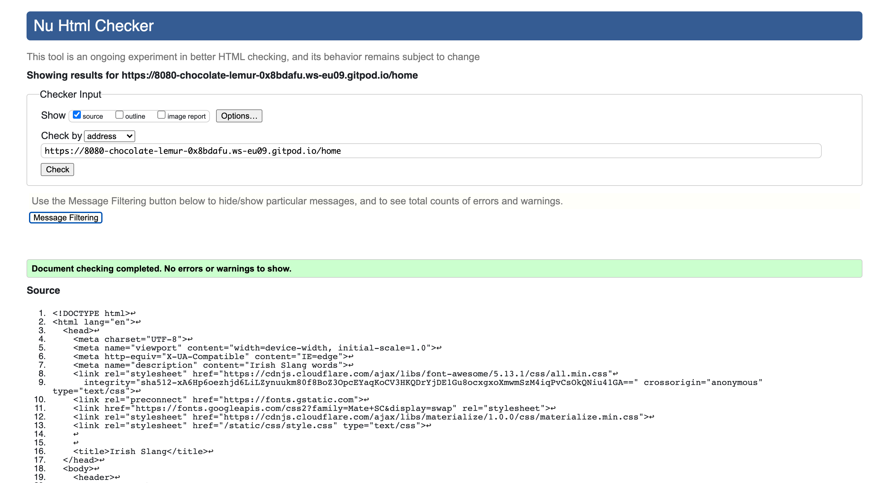

* No errors.

* Glossary page

 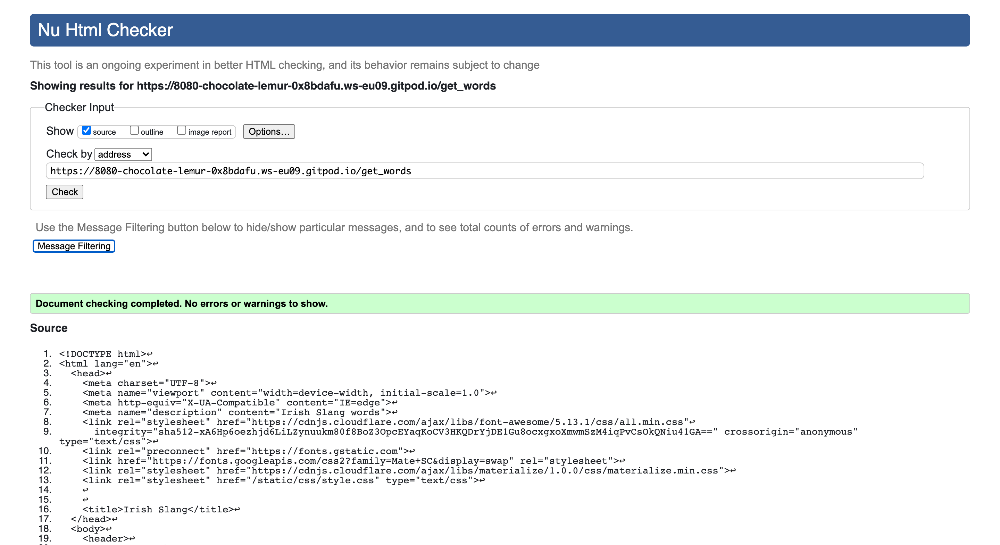

* add category page

no errors.

* add word page

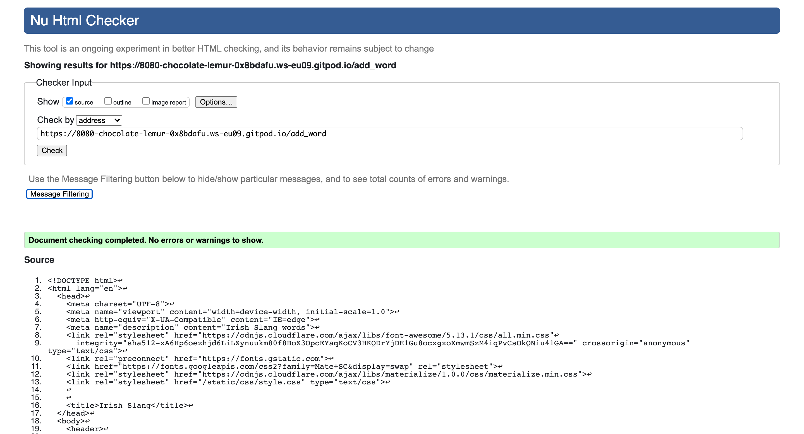

* no errors.

* edit category page

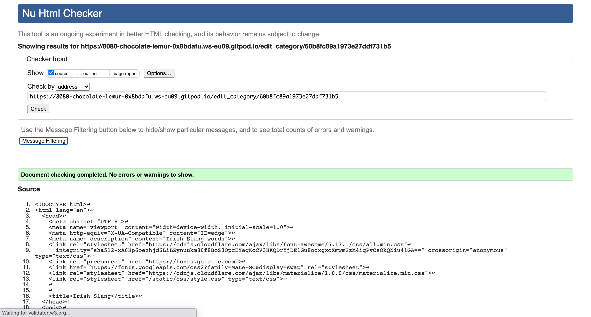

no errors.

* edit word page

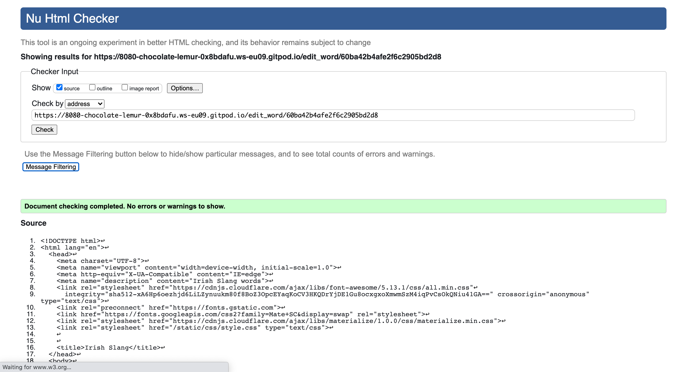

* no errors.

* get categories page

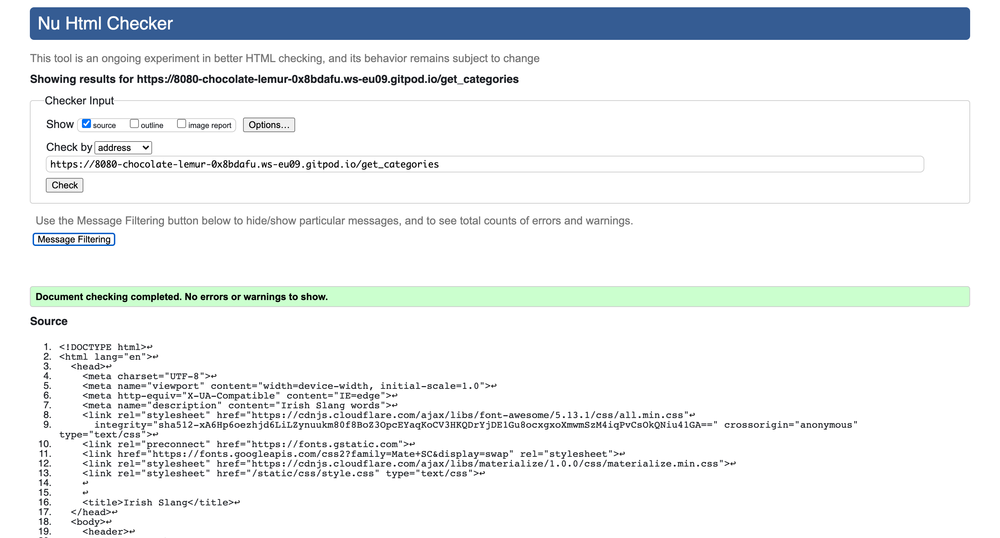

* no errors.

* Log in page

* no errors.

* register page

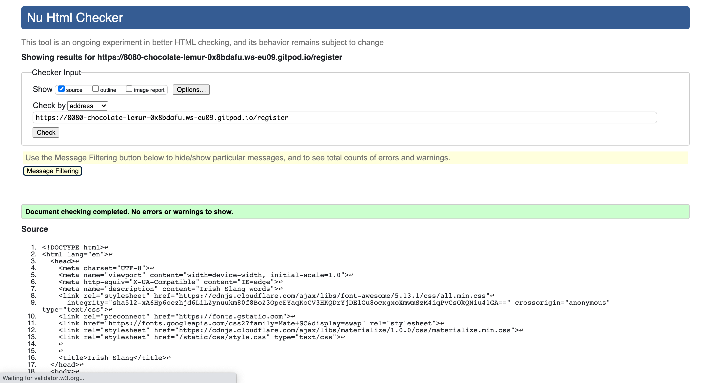

* no errors.

* profile page

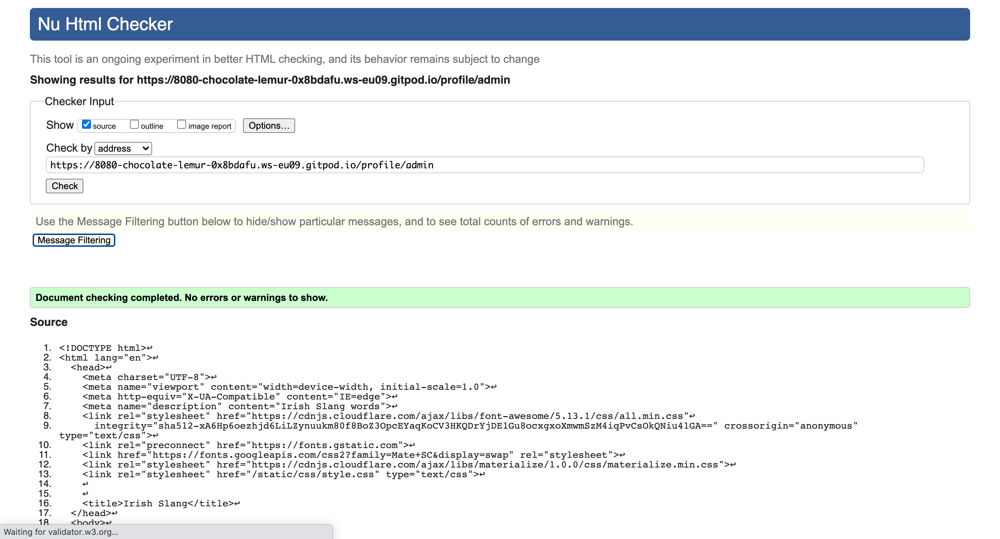

* no errors.

### CSS validator

* Style.css

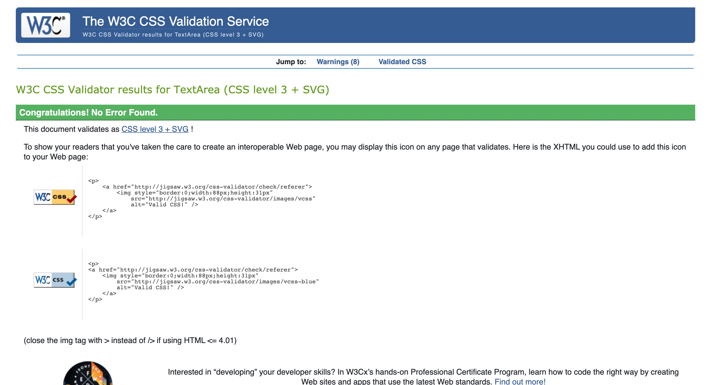

### Javascript validator

* Javascript

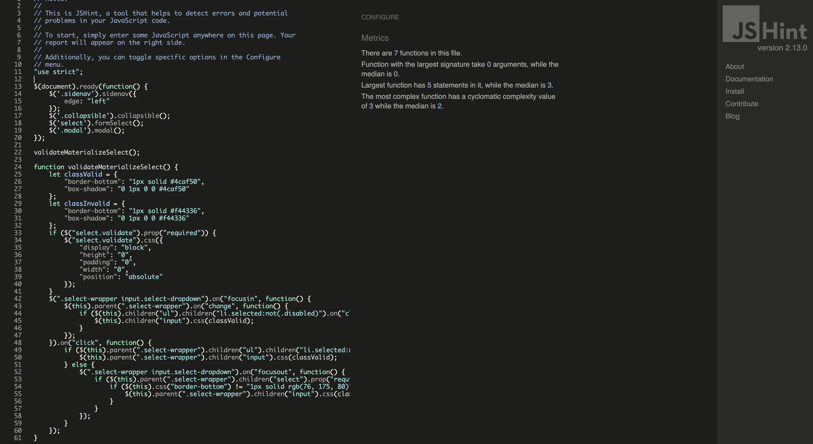

* No errors.

### Python validator

* Python

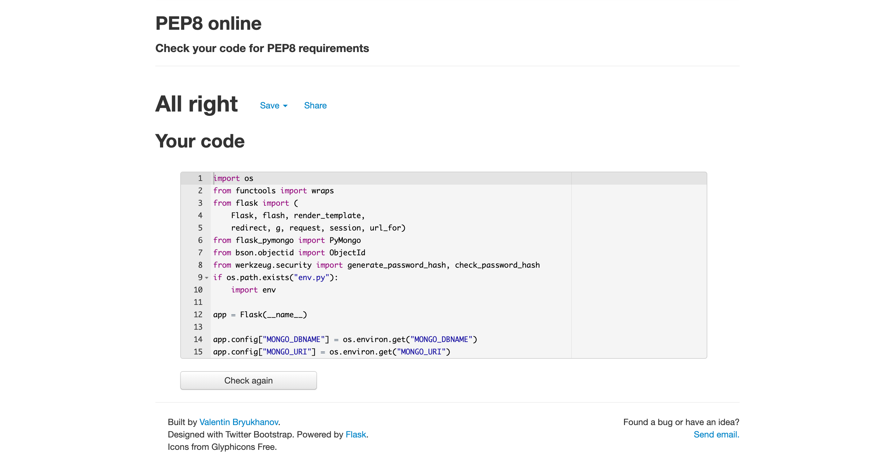

* No errors.

### Heroku app 

* Heroku app

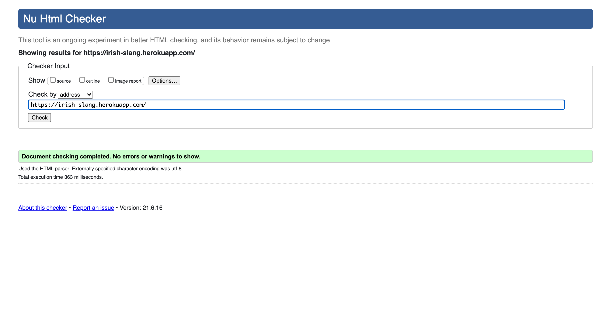

* No errors.

## Compatability Testing

| Compatability tests                         | Chrome | Firefox | Edge |
| --------------------------------------------| ------ | ------- | ---- |
| Is the website compatable on these browsers?     |   Yes  |    Yes |  Yes   |

## Testing User Stories

### First time user stories

1. I want to be able to navigate with no issues throughout the site.

pictured below is the home page with the navbar. When user is logged in (first image) all navlinks are working fine along with the navlinks when the user
is not logged in(second image)

User is logged in navbar

.png)

User is logged out navbar

.png)

The navbar is fully responsive so all navlinks will always be on display. all navlinks have been tested to confirm they lin to their correct
destination.

2. I want to be able to search for words commonly used in Ireland.

Below is the search bar on the glossary page, once the user searches a word that is in the dictionary, then the word will appear. However If
the word ends up not being in the dictionary then an else statement will be fired including a very Irish saying "jayney mac".

The search bar

.png)

When user goes to search for a word that is in the dictionary, the word will appear in its collapsible header. The example used here will be the word "craic".

.png)

However when the user goes to search for a word that is not in the dictionary, the else statement will be fired.

.png)

3. I want to be able to create my account and to add my own words to the site.

To create an account the user must go to the register page and fulfill the criteria of 8 characters and less than 15 characters for their username and password.
The user can go and add their own words via the add word navlink in the navbar(see user story 1 for 'add word' link in navbar) or via the
add word button on the glossary page or their profile page.

How user can register an account. A random username was chosen just for demonstration purposes.

.png)

Once user's account is created they will be redirected to their profile page.

.png)

For user to add words to the site, they click add word in navbar or add word button on the profile page pictured above. They will then be brought to the page.

.png)

### Registered user stories

1. I want to be able to safely and easily log in, log out of the site.

Below is when the user is about to log out, the url in the browser search bar will be copied and pasted back into the url once user logs out to determine
user security level. 

.png)

When user now goes to log out they receive a flash confirmation message that they have been logged out.

.png)

trying to copy and paste the admin url back into the browser search bar will flash a message that the user must be logged in to view this page. This creates user security
for their own profile.

.png)

User who wishes to log in can do so via the log in page pictured below. The user can also log in via the link below the register form on the register page.

.png)

link below register form on register page for user who wishes to login.

.png)

2. I want to be able to edit, delete the words that I added to the site.

Once user is signed in they have the option of viewing the words they have added to the glossary or from their profile. Accompanying those words 
are an edit and a delete button.

profile page.

.png)

Glossary page

.png)

3. I want to be able to delete my profile that I created.

If user wishes to delete their profile they can do this by going to their profile page and go to the bottom of the page where you see the button that reads
delete profile. Once user clicks button a modal will pop out asking the user if they are sure that they wish to delete their profile.

.png)

4. I want to be able to see words added by other users of the site.

User can see words added by other users but can not edit or delete those words. Pictured below user can see words added by other users.

## Site owner stories

1. To give site accessibility even if user has not created an account.

Despite user not having an account the user can still browse through the dictionary. See below that no button can be edited or deleted because the user
can't make a wor without making an account.

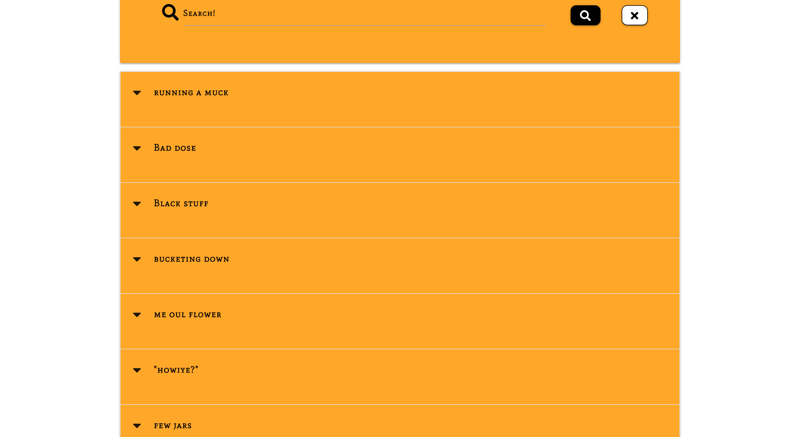

2. To allow users to soley edit, delete their own words that they have added.

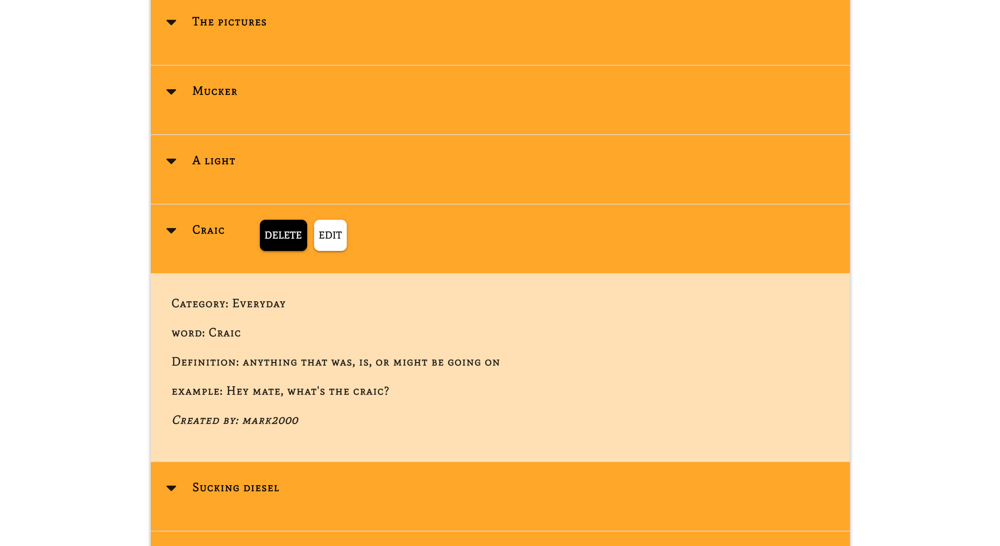

3. To be able to delete any material added by a registered user which falls under misconduct of site regulations.

Since the site owner is the admin they have the power to delete any material which may cause offence to some users of the site. Below the user
admin has edit and delete possibilities for all words of the dictionary.

.png)

.png)

.png)

# Deployment

This website was made with gitpod which is a cloud based IDE. Code was pushed to github by using the following commands outlined below.

1. git add
2. git status
3. git commit -m "message of reason of commit goes here"
4. git push.

## Deploy website to Github Pages

The steps below outline how to deploy the website too github pages from github.

1. Type github into browser
2. Sign in with username and password
3. Select repository you want to deploy github pages
4. Select Travel Tips Ireland repository
5. Select settings based on the far right of the menu
6. Scroll down settings where you will see get to github pages towards the bottom of the page
7. Select main branch from the drop menu that is provided
8. Click to confirm using the save button on the right
9. Travel Tips Ireland is now live on github pages

## Run Project With Gitpod

1. Open the repository in GitHub markgordon22/Travel-Tips-Ireland.
2. Click code button in green on the  right.
3. Copy the url: 
4. Copy and paste the url into the url bar of a fresh tab.
5. Add gitpod.io/# at the beginning of the url copied from GitHub.
6. A new workspace will then open up.

## How to Run This In A Local IDE

1. Open  repository in GitHub markgordon22/Travel-Tips-Ireland.
2. Click code button in green on the right.
3. Copy URL from HTTPS section.
4. Open terminal in your local IDE.
5. Change your current working directory to where you wish the cloned file to be saved and allocated.
6. You then type 'git clone' with the URL you copied off of GitHub.
7. click enter and your own local clone will be created.

## Forking

 By forking the repository you can now make a copy of the repository to a github account to view, inspect without affecting or changing
 the original respository. There are three steps involved in forking.

 1. Log into github with respective username and password and locate the repository that contains the project you wish to fork.
 2. On the very right of the page you will see a fork button just below the navbar and above the settings button.
 3. You now have a copy of the original repository in your github account which you can alter and make changes.

 ## Requirements

 To deploy on Heroku the following listed below are pivotal.

 * [Git](https://git-scm.com/downloads)
 * [Heroku CLI](https://devcenter.heroku.com/articles/heroku-cli)
 * [Python 3](https://www.python.org/downloads/)
 * [PIP](https://pip.pypa.io/en/stable/cli/pip_install/)

 1. In order to install the requirements listed above you would need to type in your terminal window of your respective IDE
 pip3 install -r requirements.txt.

 2. Make a database for your project with MongoDB.
 
 * Signup Or Login to MongoDB depending on if you already have an account
 * After logging/signing in the next step is to make a cluster then a database.
 * Create the collections in your respective database.
   - Categories
   - users
   - words.

3. Environment variables in the env.py file.
   - If by default you did not get a .gitignore file in your template, simply type 'touch .gitignore'.
   - Create a file called env.py. This file will hold your environment variables. Your env.py file should
   include the following below.
   
   import os os.environ.setdefault("IP", "0.0.0.0")
   os.environ.setdefault("PORT", "5000")
   os.environ.setdefault("SECRET_KEY", "YOUR_SECRET_KEY")
   os.environ.setdefault("MONGO_URI", "YOUR_MONGODB_URI")
   os.environ.setdefault("MONGO_DBNAME", "YOUR_DATABASE_NAME")

   User must update highly confidentail information such as passwords and secret key. These details must be kept disclosed and are not
   displayed in this repo for safety and security purposes. You then must add your new env.py file to your .gitignore file.

4. The application can now be run with the use of the command python3 app.py.

## Heroku deployment

1. The first step is to make a requirements.txt file and a Procfile. Those files will allow Heroku understand the dependencies that are
required to successfully run the application, and also inform Heroku the file to run in order to launch the application.

2. Type 'pip3 freeze --local > requirements.txt'.

3. Create a procfile by typing 'echo web: python app.py > Procfile'.

4. Once these are made you can see a list of dependencies in the requirements.txt file.

### Create an app on heroku

Follow thse steps to create an app on Heroku

1. Register/sign in to Heroku depending on if you have an account.

2. Click 'Create New App' button.

3. Choose a name for your app with no spaces or captilal letters, Select your local region of where you are based, then you can click
'create app'.

4. Go to the navbar and select the 'Deploy' tab, then click 'Connect to GitHub' in the 'Deployment method' section.

5. Set up automatic deployment from your GitHub account via your Heroku account by clicking the 'Connect to GitHub' button in the middle.

6. Look for the GitHub repo that holds the name of your repo, then click 'connect'. Before you click the Enable Automatic Deploys button,
 double check the following below has been carried out:

 - In the 'Reveal Config Vars', insert the variables without quotation marks which are based in your local 'env.py' file. These
   variables are stored safely in this location because they hold data sensitive information such as the password to the MongoDB database 

- make sure the Procfile and requirements.txt have been added to the staging area to Github.

- click the "Enable Automatic Deploys" and "Deploy Branch". The new app will be created and can be viewed by simply clicking 'open app'.

# Credits

## Code

* [CSS Materialize](https://materializecss.com/) code was copied in order to create items such as collapsible accordion on the glossary page, navbar,footer and cards
on the categories page.

* Task Manager Mini project was a staple for the site created. Code was used from this project, specifically the app.py which was modified and altered for the site's
needs. Later on in the project we were given an update on the Task Manager Mini project where Tim introduced defensive programming in terms of modals in a
partial folder which was also used and modified for the site's needs. Likewise, Tim introduced a login decorator where users must be logged in
to view a page on the site. This was to enhance user safety and security. This was also used for the site. Javascript for the category select
was also used from Task manager Mini project.

## Content

* All words in glossary came from myself having already grown up in Ireland with these words and phrases used in everyday life.

## Hero images

* [leprachaun image](https://pumpkin-parcel.com/products/leprechan-wax-melts?pr_prod_strat=copurchase&pr_rec_pid=4859114520646&pr_ref_pid=6536302231622&pr_seq=uniform)

## Resources

* [Code Institute tutor team](https://learn.codeinstitute.net/ci_support/diplomainsoftwaredevelopment/tutor) who gave me excellent guidance and advice as always.
* [Youtube](https://www.youtube.com/) was helpful for me to brush up on certain aspect of backend development after finishing the course material
* [Slack](https://slack.com/intl/en-ie/) helped me get around certain aspects of development in terms of the lessons and challenges.

# Acknowledgements

* My mentor Rohit Sharma for his amazing advice, help and feedback along the way.
* The tutors at Code Institute for their amazing help and feedback when I was most stuck.
* My friends and family for their continous support.