# Irish Slang

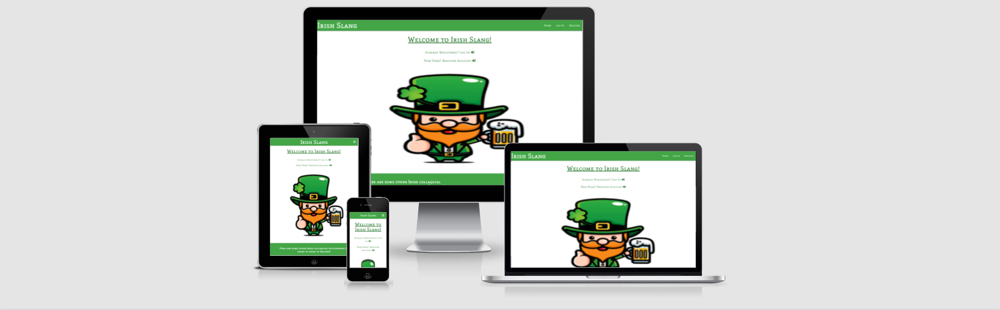

# Table of contents
- [User Experience](#user-experience)
  * [The project Goal](#the-project-goal)
- [User Stories](#user-stories)
- [User Requirements and Expectations](#user-requirements-and-expectations)
  * [Requirements](#requirements)
  * [Expectations](#expectations)
- [Design Choices](#design-choices)
  * [Typography](#typography)
  * [Icons](#icons)
  * [Colours](#colours)
  * [Imagery](#imagery)
  * [Wireframes](#wireframes)
- [Features](#features)
- [Features left to implement](#features-left-to-implement)
- [Technologies](#technologies)
- [Testing](#testing)
  * [Lighthouse Testing](#lighthouse-testing)
  * [Bugs](#bugs)
  * [Functionality Testing](#functionality-testing)
  * [Responsiveness Testing](#responsiveness-testing)
  * [Usability Testing](#usability-testing)
  * [Testing Validators](#testing-validators)
  * [Compatability Testing](#compatability-testing)
  * [Testing User Stories](#testing-user-stories)
- [Deployment](#deployment)
  * [Deploy website to Github pages](#deploy-website-to-github-pages)
  * [Run Project With Gitpod](#run-project-with-gitpod)
  * [How to Run This In A Local IDE](#how-to-run-this-in-a-local-ide)
  * [Forking](#forking)
- [Credits](#credits)
  * [Code](#code)
  * [Content](#content)
  * [Hero images](#hero-images)
  * [About page images](#about-page-images)
  * [Our Tips page images](#our-tips-page-images)
  * [Resources](#resources)

- [Acknowledgements](#acknowledgements)

# User Experience

## The project Goal  
* The goal of this project is to creare a fictional glossary/dictionary website for words that are spoken on a daily basis among Irish people. It is aimed at people who wish to
visit Ireland in the future and have an interest or an intrigue in words/phrases Irish people use.

# User Stories

## First time user stories

* I want to be able to know what the site is about.
* I want to be able to navigate with no issues throughout the site.
* I want to be able to search for words commonly used in Ireland.
* I want to be able to create my account and to add my own words to the site.
* I want to be able to see commonly used words by Irish people through viewing the most popular and/or least popular additions.

## Registered user stories

* I want to be able to safely and easily log in, log out of the site.
* I want to be able to edit, delete the words that I added to the site.
* I want to be able to edit, delete my profile that I created.
* I want to be able to see words added by other users of the site.

## Site owner user stories

* To give site accessibility even if user has not created an account.
* To allow users to soley edit, delete their own words that they have added.
* To be able to delete any material added by a registered user which falls under misconduct of site regulations.

# User Requirements and Expectations

## Requirements

* To navigate around the site in an easy fashion with no broken internal links
* All features such as login, register, contact form, collapsible and card-panels to be operating efficentley
* All text content to eligible, readbale and viewable across different devices such as desktop, tablet and mobile.
* for website to have a high level of safety and security when user is logged in the copied url once pasted when the
  url has logged out will be redirected back to the log in page.

## Expectations

* Navigation of the website is working appropriatley efficentley with no broken internal links.
* All features in above in requirements section is working appropriatley.
* Text content is easy to read,view across all devices
* Website is highly secured with user's profile secured against intrusion from other users, vistors to the site.

# Design Choices

* Considering this is an Irish slang dinctionary I wanted the color scheme to adopt the tricolor flag colors of Ireland which is green, white and orange.
  The feeling was that it was the most appropriate design choice of colors as users will instantly feel the connection between the Irish tricolors and the slang glossary.
  An image of a leprachaun is present on the homepage to offer imagery but to also offer a well reknowned representation of Irish fiction.
  Features such as login, register, contact form, search bar and collapsible glossary are styled identically for consistency in design. Collapsible, footer,buttons and navbar and sidenav are taken from
  [CSS Materialize](https://materializecss.com/) for instant responsiveness and positive looking user interface

## typography

* [Google Fonts](https://fonts.google.com/) was used for the site. The font family adopted  was  Mate SC as I felt it was an attractive, readbale and eligible font to use. In case Mate SC did not
  load sans serif was used as the back up font.

## Icons
* [Font Awesome](https://fontawesome.com/) icons were used as a decorative purpose used to style the site including the social media links, buttons and form elements such as the login and 
  and registration.

## Colours

* [Coloors](https://coolors.co/) was used to portray visually my color scheme adopted. The colors used resembled the Irish flag to get an Irish feel as the site is a 
Irish slang dictionary. To view color scheme click [here](https://github.com/markgordon22/irish-slang/blob/master/wireframes/colorscheme.png).

## Imagery

* The sole image used for the site was a hero image on the home page of a leprachaun with a pint of beer. Once the user accesses home page and begins
their journey through the site they will see the image. Image of the leprachaun was used as it fits one of the stereotypes that leprachauns exist.
Image of the leprachaun evokes the feeling of Ireland to the user that can not be carried out with plain text. 
Click [here](https://github.com/markgordon22/irish-slang/blob/master/static/img/leprachaunimage.jpg) to see the image.

## Wireframes

* See wireframes [here](https://github.com/markgordon22/irish-slang/blob/master/wireframes/wireframes-irish-slang.pdf)

# Features

* Features implemented for the website include the following.

* Simple and easy navigation around the site.
* Consistent and easy to follow design.
* Contact form for user to enquire about any concerns or queries they have now or in the future.
* Login, register forms for user to log into their account or register account
* Glossary of Irish words for user to browse through slang words of Ireland
* Search bar for user to search a word.
* CSS materialize buttons and cards.
* Responsive on phone, tablet and desktop devices.

# Features left to implement

* None

# Technologies

 Technologies used

 Languages

* [HTML](https://en.wikipedia.org/wiki/HTML)
* [CSS](https://en.wikipedia.org/wiki/CSS)
* [Javascript](https://en.wikipedia.org/wiki/JavaScript)
* [Python](https://en.wikipedia.org/wiki/Python_(programming_language))
* Python modules and dependencies based in requirements.txt file.
  * click==8.0.1
  * dnspython==2.1.0
  * Flask==2.0.1
  * Flask-PyMongo==2.3.0
  * itsdangerous==2.0.1
  * Jinja2==3.0.1
  * MarkupSafe==2.0.1
  * pymongo==3.11.4
  * Werkzeug==2.0.1
   

Libraries and Frameworks

* [Am I Responsive](http://ami.responsivedesign.is/) Used to create a mockup of website.
* [Autoprefixer CSS Online](https://autoprefixer.github.io/)
    -  used to parse project CSS and add vendor prefixes.
* [BSon](http://bsonspec.org/)
    - This was imported in order to access the data used across the site.
* [HTML validator](https://validator.w3.org/)
    - testing validator for html code
* [Javascript validator](https://jshint.com/)
    - testing validator for javascript code
* [CSS validator](https://validator.w3.org/) 
    - testing validator for css code
* [pep8 validator](http://pep8online.com/checkresult)
    - testing validator for python code
* [Flask](https://flask.palletsprojects.com/en/1.1.x/)
    - Flask was used to import the following below
    * flash
    * render_template
    * redirect
    * request
    * session
    * url_for functions.
* [JQuery](https://jquery.com/)
    - JQuery in scripts.js file in static folder was used to activate materialize components. To add, I also used Code Institute's JQuery code from the Task Manager project so that the category names could be selected and cited.
* [Balsamiq](https://balsamiq.com/) 
    - to do wireframes for respective devices
* [Font Awesome](https://fontawesome.com/)
    - Font awesome used in site to implement icons for atractive visual purposes, boosting user experience. 
* [Git](https://git-scm.com/)
    - Git - for version control with the use of the gitpod terminal to commit to Git and push code to GitHub.
* [GitHub](https://github.com/)
    - GitHub - used for storage of code after it has been pushed Gitpod terminal.
* [Google Fonts](https://fonts.google.com/)
    - Google fonts were used to import selected font
* [CSS formatter](https://www.cleancss.com/css-beautify/)
    - To beautify css code
* [Javascript formatter](https://beautifier.io/)
    - To beautify javascript code.
* [Heroku](https://dashboard.heroku.com/apps)
    - Heroku is used for deployment of the site.
* [Autoprefixer](https://autoprefixer.github.io/) 
    - to add vendor prefixes to css
* [Materialize 1.0.0](https://materializecss.com/)
    - used for responsiveness and styling purposes. Materialize was used for cards,navabar,footer and buttons.   
* [MongoDB](https://www.mongodb.com/1)
    - MongoDB - used to host data on site.
* [HTML freeformatter](https://www.freeformatter.com/html-formatter.html)
    - to beautify html code  
* [Werkzeug](https://werkzeug.palletsprojects.com/en/1.0.x/)
    - Password security to authenticate site.
* [Markdown](https://docs.github.com/en/github/writing-on-github/basic-writing-and-formatting-syntax) 
    - Assisted with links site elements such as images,content,wireframes and code sources used.
* [GitHub Wiki TOC generator](https://ecotrust-canada.github.io/markdown-toc/) 
    - to generate own MarkDown TOC online.
*  Chrome dev tools to detect bugs in the code.

# Testing

## Lighthouse testing

## Bugs

Bugs I encountered along with a solution.

1. Navbar brand-logo was not responsive on smaller devices as the large font-size created an overflow.
Solution - made media queries for the brand logo so that all of the text would be placed in the navbar with zero overflow.

2. ul collapsible on profile page remained on screen despite user having words inserted on their own profile. 
Solution - I contacted tutor support about this and they decided it be best to give the ul collapsible the same color as the card-panel so that it would be hidden from view.

3. Delete and edit buttons on glossary page flowed to the next line under the collapsible header creating an unappealing ux.
Solution: Decreased padding of buttons and font-size so that they will take up less space on the collapsible header.

4. Unsure of how to go about implementing defensive programming in terms of using modals for the words in case a user wishes to delete a word.
Solution: Tim from code Institute tutor team gave us a great insight of to solve this in a masterclass by giving a modal id of id="modal-{{ word._id }}"
This will activate a modal on any word once the delete button is clicked.

5. Once user copies and pastes a url off a specific page on the site, logs out and then tries to paste the url into the browser, the page will load
despite the user not having to log in which reduces user safety and security.
Solution: Used a login required decorator so user must be logged in order to access the site's page [see here for code used](https://flask.palletsprojects.com/en/2.0.x/patterns/viewdecorators/)

6. My else statement on the profile page was not working despite the code seemingly to be correct. 
Solution - I played around with the code and put the if statement inside the for loop. Once this happened the else statment was operating as it was intended.

## Functionality Testing

### Welcome page

* Navbar links all work with no faults and navigate to their correct destination. Hero image is looking well with no stretching.
  links are working well with no faults and lead to their correct destination. Footer links to external Irish slang websites
  are working well along with the social media icons working fine.

### Glossary page

* Navbar and footer links are all working fine. When user searches a word it successfully reveals the word or displays an "no results found" message.
  Collapsible header and body are looking well and working fine. When user clicks on the icon in the collapsibe header, the body becomes visible showing the category word,
  an example, definition and the author of the word. The delete and edit buttons are working and carrying out their intended purpose.
  Add word button will lead user to add word page. Modals are present when the user becomes unsure of actually deleting a word - defensive programming purposes.

### Profile page

* Navbar and footer links are working fine. If user has added a word, then that word will display on their profile, along with the edit and the delete
 buttons which are working perfectly. However, if the user has not added a word, then a card-panel will display on screen saying that the user has no words added. If
 user wants to add a word then the add word button will lead them to add word page. If user wants to terminate their profile,
 they can carry that out and press the delete button where a confirmation modal will pop asking user if they are totally certain of deleting 
 their profile. 

### Add word page

* Navbar and footer links are working well and correctly. User can add a word by selecting a category from the dropdown and insert the definition,
example in the respective inputs. The add word button will send the new word added to the user profile and glossary page. A flash meesage will appear
that the user has created a word. The cancel button will be able to redirect the user back to the glossary page.

### Manage categories

* Navbar and footer links are both working right. Admin can successfully edit or delete categories displayed, by clicking on one of the respective
buttons. Add category button will redirect admin to add category page.

### Add category

* Navbar and footer links are working. Add category button working fine and when user adds a category, a flash message will pop up that admin
has successfully created a new category. The cancel button will lead admin to redirect back to the categories page with no flash message.

### Edit category

* Navbar and footer links are working correctly. Edit category button once clicked which is followed by a flash message saying 
that a category has been updated. Cancel button will lead user back to the categories page with no flash message.

### Edit word

* Once user clicks on the edit button in their profile for a word it will lead to the edit word page. Here, there is a select element and 3 inputs.
 The user must insert text into all inputs and select a category in the select element at the top of the card-panel. A flash
 message will pop out that the word has been updated. The user may wish not to edit where they can 
 simply return to the glossary page with no flash message by clicking the cancel button.

### Log in page

* The user is directed to the login page from the welcome page. The user must enter a username and password that corresponds to the minimumlength,
maximum length and pattern. Once the user successfully logs in they are redirected to their designated profile page with a welcome flash message.

### Register page

* User is directed to the register page from the welcome page. Similar to the log in page, the user must adhere to the guidelines surrounding
username and passwords. Once user register they get redirected to their profile page with a welcome flash message.

## Responsiveness Testing

Responsiveness of the site was carried out with the use of the devices in chrome developer tools. 
They included the following outlined below with responsiveness result.

* Moto G4 - Successful
* Iphone 4 - Successful
* Galaxy s5 - Successful
* Pixel 2 - Successful
* Pixel 2 XL - Successful
* Iphone 5/SE - Successful
* Iphone 6/7/8 - Successful
* Iphone 6/7/8 plus - Successful
* Iphone X - Successful
* Ipad - Successful
* Ipad Pro - Successful
* Surface Duo - Successful

Desktop responsiveness - successful

## Usability Testing

## Testing Validators

### HTML VALIDATOR RESULTS

* Home page

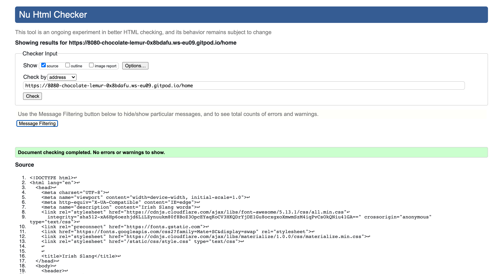

* No errors.

* Glossary page

 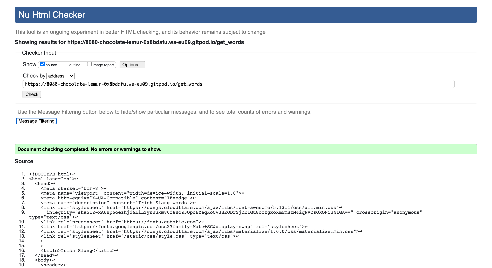

* add category page

no errors.

* add word page

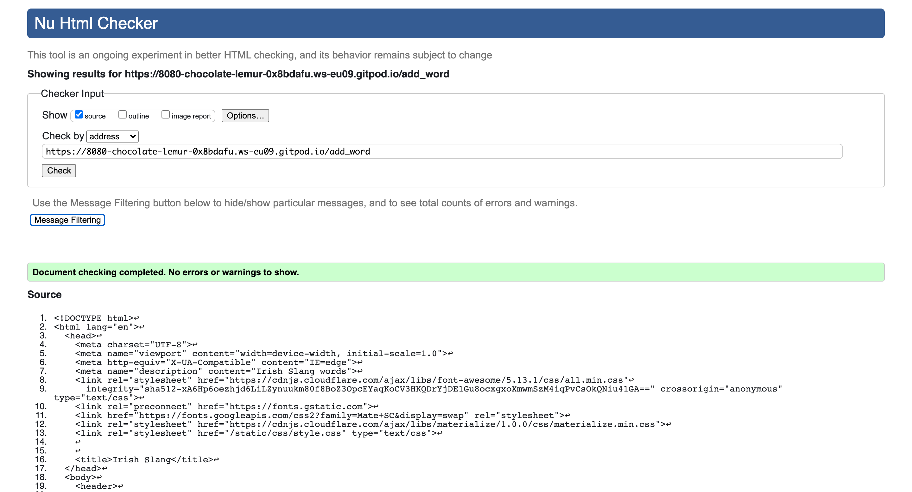

* no errors.

* edit category page

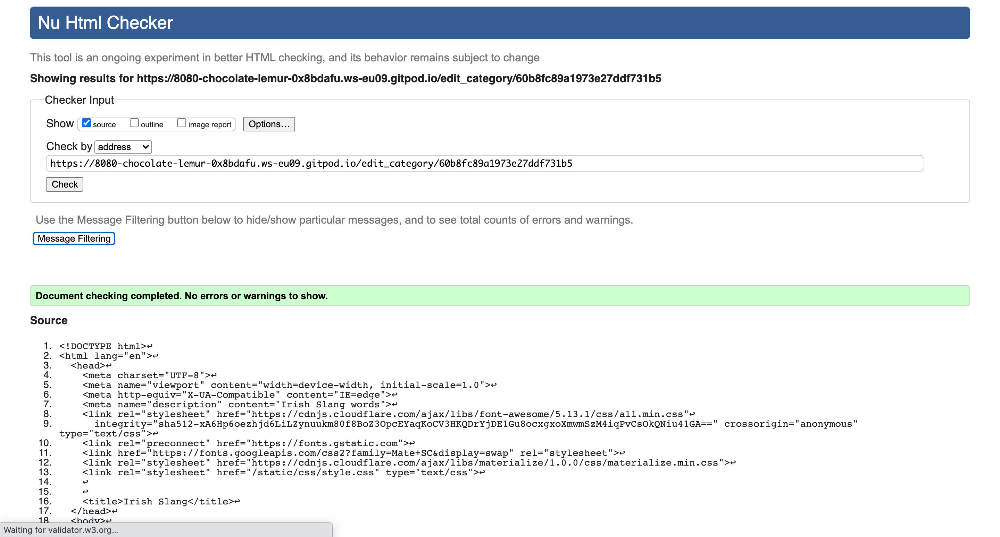

no errors.

* edit word page

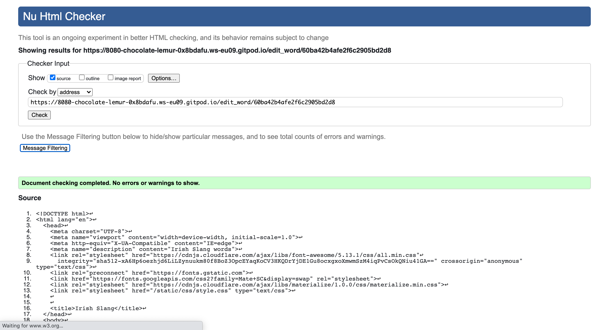

* no errors.

* get categories page

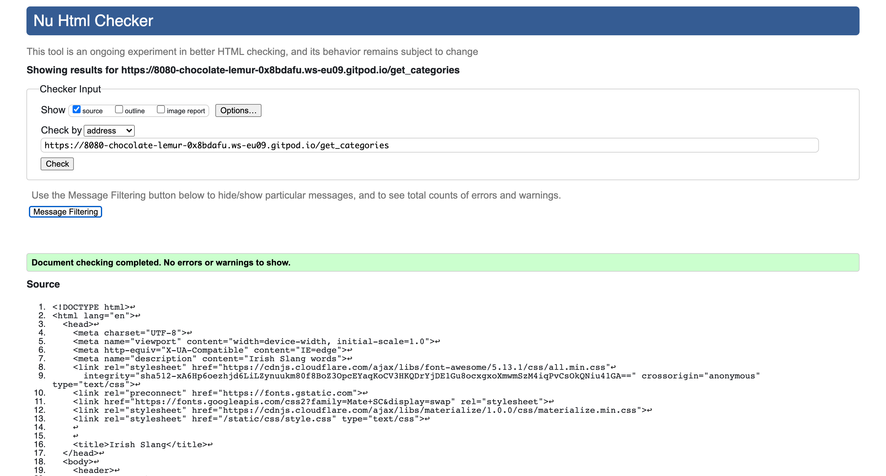

* no errors.

* Log in page

* no errors.

* register page

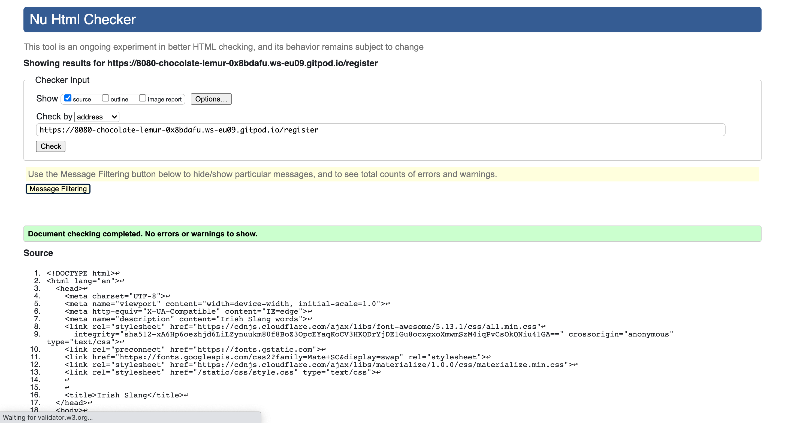

* no errors.

* profile page

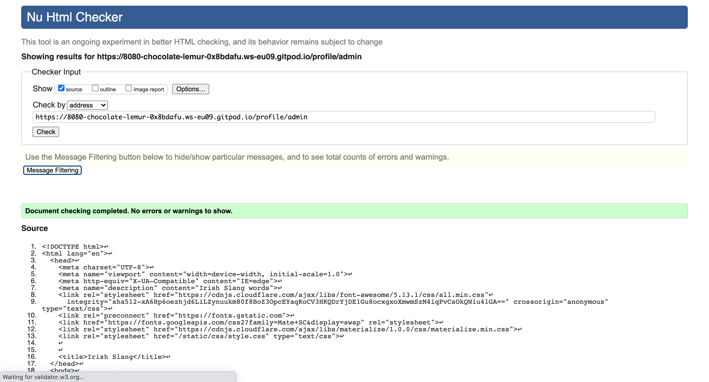

* no errors.

### CSS validator

* Style.css

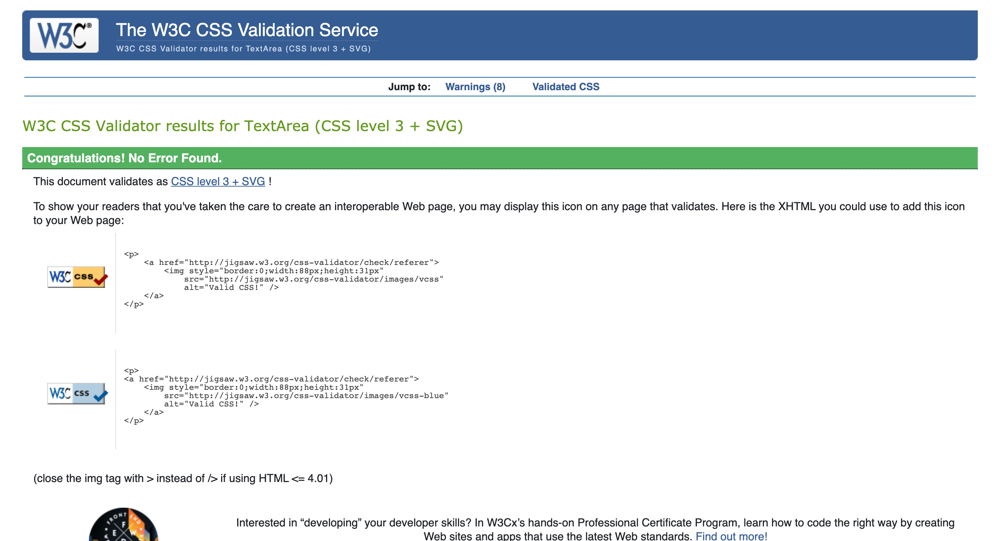

### Javascript validator

* Javascript

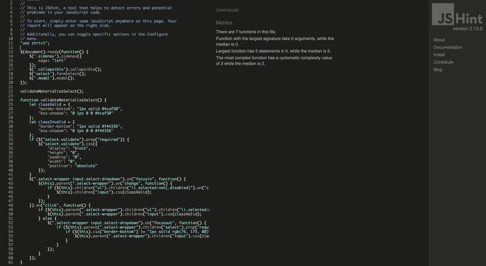

* No errors.

### Python validator

* Python

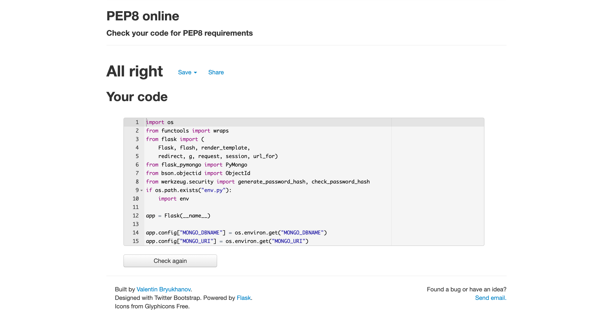

* No errors.

### Heroku app 

* Heroku app

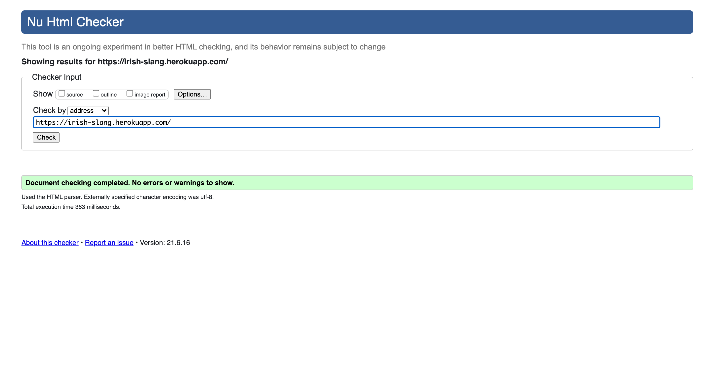

* No errors.

## Compatability Testing

## Testing User Stories

# Deployment

## Deploy website to Github Pages

## Run Project With Gitpod

## How to Run This In A Local IDE

## Forking

# Credits

## Code

## Content

## Hero images

## Resources

# Acknowledgements
